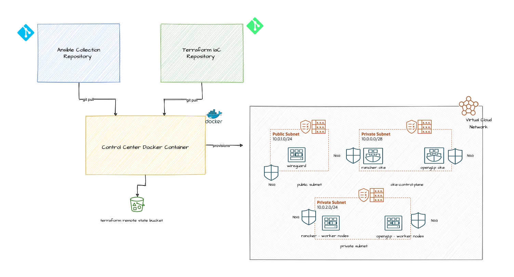

### OCI Deployment

The purpose of this control center is to provide a working development runtime enviornment for running infrastructure as code(IaC).
This is a docker container with pre configured runtime enviroment.

- Infrastructure as Code 
    - Terragrunt
    - OpenTofu
- Configuration management
    - Ansible

Control Center Architecture




### Deployment Prerequisites

For OCI cloud provider

-   Generate admin user api keys as per [OCI Docs](https://docs.oracle.com/en-us/iaas/Content/API/Concepts/apisigningkey.htm#two)
-   Capture the values for
    - user_id
    - tenancy_id
    - fingerprint
    - region
    - private_key
-   Create a customer secret key for storing terraform state in remote bucket as per [OCI Docs](https://docs.oracle.com/en-us/iaas/Content/Object/Tasks/s3compatibleapi.htm#usingAPI)
-   Capture the values for
    - s3 access key
    - s3 secret key
    - s3 region
    - s3 comptability api endpoint
-   Create bucket for storing terraform state files
    - capture the name of the bucket

### Create docker image
```
    git clone https://github.com/ddevadat/iac-devops.git
    cd control-center
    docker build -t control-center-iac-devops .

```

### Start the container

```
docker run -d --name <container_name> control-center-iac-devops sh -c 'while true; do echo "Running"; sleep 360000; done'

```

### Login to the container & set the env variables

```
docker exec -it <container_name> /bin/bash

cd /iac-run-dir
modify environment variables in setenv as appropriate

source setenv
./init.sh
cd /iac-run-dir/iac-devops/terragrunt/istio-multi-region
modify environment.yaml file as appropriate

```

### Build infrastructure

This IaC uses opentofu and terragrunt for managing the project hierarchy. Entire provsioning roughly takes about 1 hr.

```
docker exec -it <container_name> /bin/bash
cd /iac-run-dir
source setenv
cd /iac-run-dir/iac-devops/terragrunt/istio-multi-region
./run.sh

```


### Cleanup infrastructure

Before running cleanup make sure you are disconnected from wireguard vpn

```
docker exec -it <container_name> /bin/bash
cd /iac-run-dir
source setenv
cd /iac-run-dir/iac-devops/terragrunt/istio-multi-region
./deleteAll.sh

```